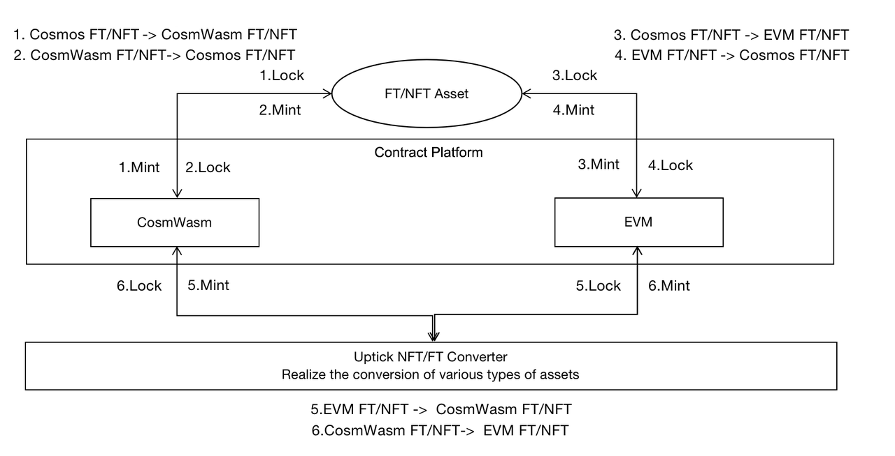

# Overview

Smart contracts are highly deterministic, tamper-proof, and reliable digital agreements that run on decentralized blockchains. Since NFTs were initially built on the ERC protocol, most mainstream NFT platforms now support smart contracts. Uptick chain also supports the smart contracts of the main process, which now includes EVM and Wasm smart contracts, and will support more types of smart contracts in the future according to the business needs of the application.

Moreover, traditional NFT platforms only support NFT assets on EVM or WASM. Both types of NFT assets have their application scenarios and business requirements for mutual conversion.

Therefore, Uptick provides support for mainstream EVM and WASM contracts and seamless conversion between the two types of assets at the contract layer.

